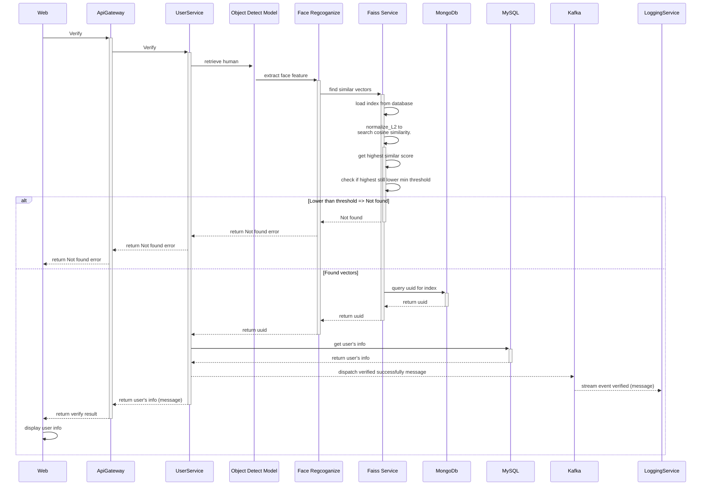

To view this diagram in vscode, 
try to install extension: bierner.markdown-mermaid
then view this file with preview mode.

```mermaid
sequenceDiagram
%% Verify
    participant w  as Web
    participant  ag as ApiGateway
    participant  us as UserService
    participant d as Object Detect Model
    participant fr as Face Regcoganize
    participant fs as Faiss Service
    participant mg as MongoDb
    participant ms as MySQL
    participant kf as Kafka
    participant lg as LoggingService

    w->>+ag: Verify
    ag->>+us: Verify
    us->>+d: retrieve human
    d->>+fr: extract face feature
    fr->>+fs: find similar vectors
    fs->>fs: load index from database
    fs->>+fs: normalize_L2 to <br/> search cosine similarity.
    fs->>fs: get highest similar score
    fs->>fs: check if highest still lower min threshold
    alt Lower than threshold => Not found
        fs-->>-fr: Not found
        fr-->>us: return Not found error
        us-->>ag: return Not found error
        ag-->>w: return Not found error
    else Found vectors
        fs->>+mg: query uuid for index
        mg-->>-fs: return uuid 
        fs-->>-fr: return uuid
        fr-->>-us: return uuid
        us->>+ms: get user's info
        ms-->>-us: return user's info
        us-->>kf: dispatch verified successfully message
        kf-->>lg: stream event verified (message)
        us-->>-ag: return user's info (message)
        ag-->>-w: return verify result
        w->>+w: display user info
    end
    

```
    

